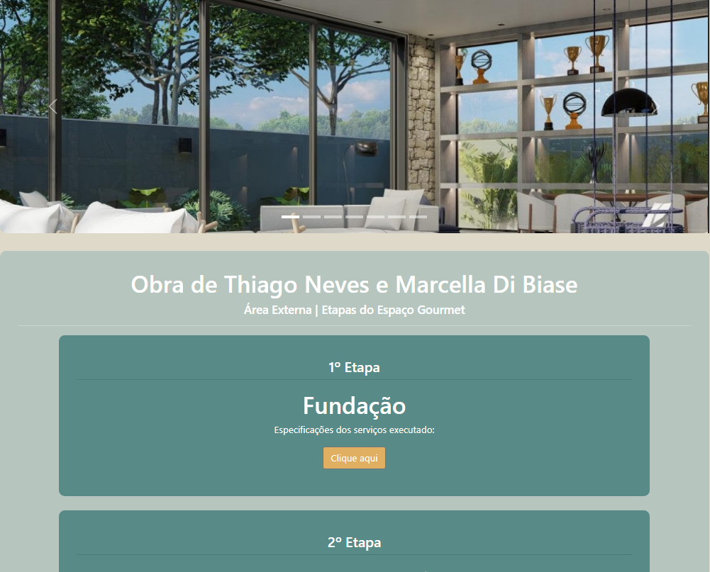

<h1 align="center">🏡 Landing Espaço Gourmet</h1>
<h3>Página para apresentar o processo de planejamento de uma obra e a construção da área gourmet.</h3>

 
[🔗 Click here to acess](https://wictorluciano.github.io/Landing-EspacoGourmet/)

<a href="https://wictorluciano.github.io/Landing-EspacoGourmet/" align="center">🔗 Click here to acess</a>

## 💻 Technologies

- CSS
- HTML
- GIT & Github

## ⭐ Contact

 
  
  
   

